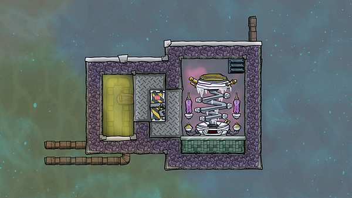
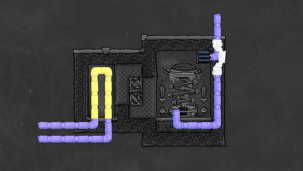
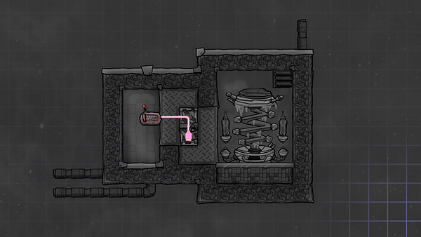

This design uses a conductive door controlled by a thermo sensor to keep a body of liquid at the desired temperature. It works well for instance with a SPOM, feeding in oxygen for cooling and excess hydrogen from the SPOM to power the cooling loop.

Thermo sensor: below \[temperature you want coolant to be\]

Use steel (or better conducting material) for the door

Note: powering the door is optional. This design has an overflow gas piping that feeds the anti entropy thermo-nullifier first and only fills the room when there is extra hydrogen.

If you want to read a bit about how it all works, and see an option for a variation on this design, see: Anti entropy thermo-nullifier cooling.

---

Design by Francis John

Source: "Cooling, ATEN, Aquatuners and Steam turbine heat deletion. Tutorial 7 Oxygen not included", by Francis John.

Available at: https://www.youtube.com/watch?v=36qR5nAH5qw, accessed 12 August, 2020

You can further improve the temperature transfer by adding tempshift plates so they touch all three metal tiles. (Thanks to several people on Reddit for that tip. See the comments for their additional ideas on improving heat transfer.)
