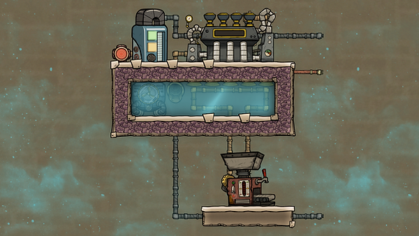
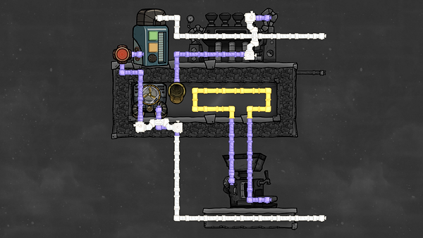
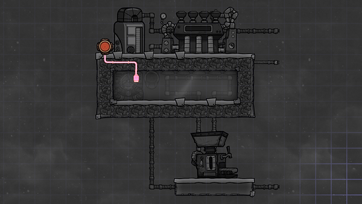

This design combines several things. A metal refinery and cooling system for its input/output liquid, an aquatuner cooling loop to circulate a cooling liquid in your base, and a steam turbine to turn some of the heat generated by these machines into power.

Liquid pipe thermo sensor: above \[temperature you want in your base\]

Use steel for the thermo aquatuner

Use crude oil (or better) as liquid in the metal refinery cooling loop.

Note: the box under the aquatuner should be filled with enough liquid when starting it up that there are no gas bubbles in the box. You can also mix two different kinds of liquids: e.g. first a layer of polluted water, then a layer of water. This will save some liquid (and time spent filling the box). The liquid storage is optional. It helps even out the temperature but the design also works without it.

In constant use, this design will overheat the pipe section leading out of the metal refinery. To solve this problem, you can double the size of the heat deletion section and add a second steam turbine.

## Source

Design by Francis John

Source: "Getting mid game Steel, Plastic & Cooling : Tutorial nuggets : Oxygen not included", by Francis John.

Available at: https://youtu.be/OlzfMNGCb4E?t=593, accessed 11 August, 2020

You can also put the liquid reservoir and thermo sensor after the thermo aquatuner. Such a design is otherwise identical, but gives a more even output temperature - the water always starts the cooling loop at exactly the temperature you want.

For an introduction to the thermo aquatuner and steam turbine cooling loop design, see:

Thermo aquatuner & steam turbine cooling loop.

(That page also has overlays of a version with the liquid reservoir after the thermo aquatuner.)
