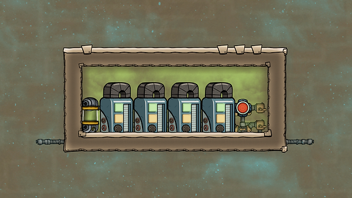
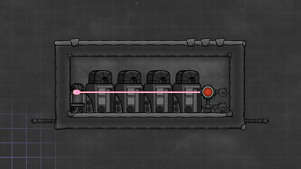
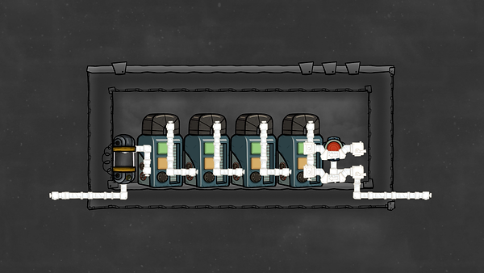

This design uses an overflow mechanism combined with a sensor and a liquid shutoff to make sure germy water is in chlorine long enough that all germs are killed off when it comes out the other side. (In theory three tanks should be enough, this design uses four to be safe.)

Liquid pipe element sensor: polluted water

Note: This design needs to be built in two stages. The liquid storage tanks need to be pre-filled with polluted water. Then deconstruct the pipes and let the liquid storage tanks sit in chlorine until germ-free. Then you can build/connect the final design's piping. This is because chlorine kills germs in tanks but not in pipes. (See the source video for a walk/talk-through. Or the Recycling Toilet Water guide on this site) Power isn't included here. The liquid shutoff needs 10W. Germy water enters the build from the right and exits germ-free on the left.

## Source

Design by Francis John

Source: "QOL Mk3, 36 Germ decontamination for toilets and spin that vacillator : Oxygen not included", by Francis John.

Available at: https://youtu.be/SEL3pxB5tao?t=102, accessed 11 August, 2020

Guides: For a video of this build, check Francis John's YouTube video. If you were looking for a written guide, see Recycling toilet water.
