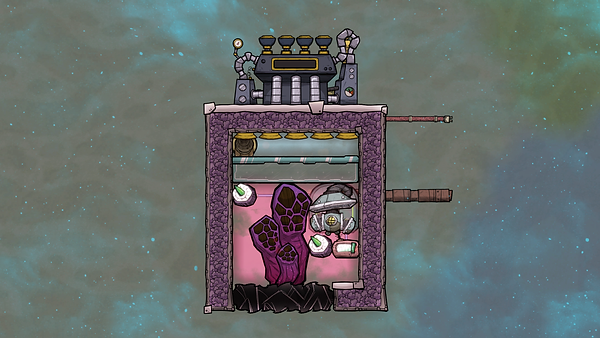
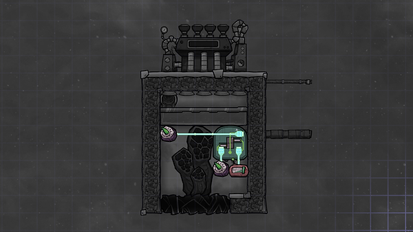
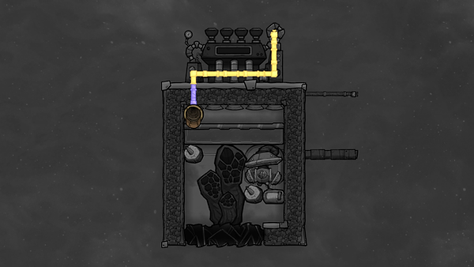

This design pumps out 130-140 degree hydrogen. Even if started in a vacuum, it won't overheat.

Atmo Sensor (upper left): Above 4000g

Atmo Sensor (below gas pump): Above 1000g

Thermo Sensor: Below 135

Use steel for the Gas Pump

Note: Radiant liquid pipes help cool the steam turbine. You can also enclose the steam turbine and let the radiant pipes handle the cooling. (See Mullematsch's YouTube vidoe for a demonstration of this.) And, of course, you can hook the steam turbine to your base's heavy wire network instead, if you want to harness the powere for your base.

Design by Mullematsch

Source: "Self Cooling Hydrogen Vent (Oxygen Not Included - Tutorial)", by Mullematsch.

Available at: https://www.youtube.com/watch?v=wZmEhP2_ojA&list=PLBM_yd3KBXvvPhc9JRj8ZTg5getR3iHZ1&index=4, accessed 2 September, 2020
