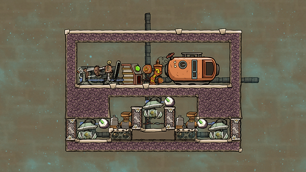
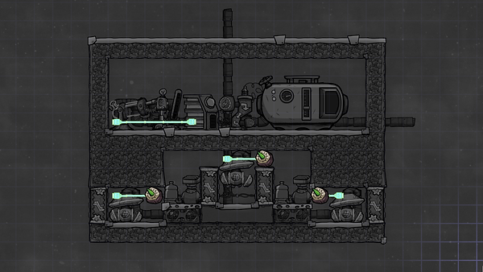
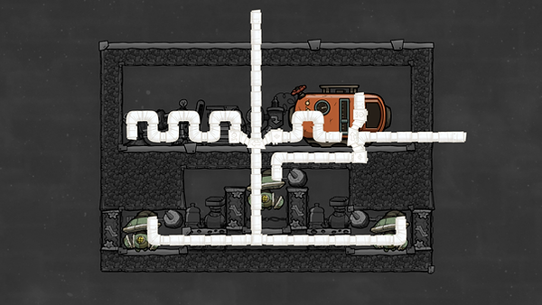

This is Francis John's take on the classic SPOM, modified to fit in a four-tile high area.

This SPOM is the so-called "Full Rodriguez". It generates 2.975 kg/second of oxygen.

Atmo sensor, upper (hydrogen): above 250

Atmo sensors, lower (oxygen): above 450

Note: use gold (or better) for things that can overheat. The upper section can be fully enclosed, as the hydrogen cools the top level. What material to build the liquid pipes out of depends on the temperature of your incoming water. If the incoming water is colder than 70C you can use the water to cool down the surrounding area by using radiant pipes.

A note on sources: the SPOM was first introduced to the world by QuQuasar in a post on Klei's forums. This design is by Nicolás Rodriguez (and popularized by Francis John).

Source: "Electrolyzer, SPOM, O2, Oxygen: Tutorial nuggets : Oxygen not included", by Francis John. Available at: https://youtu.be/6KzD2c6EQ7I?t=656, accessed 6 September, 2020

For an introduction to how SPOMs work, see:

Oxygen: To know the SPOM is to love the SPOM

Oops - I forgot the automation wire from the upper gas pump to the atmo sensor on its right.
